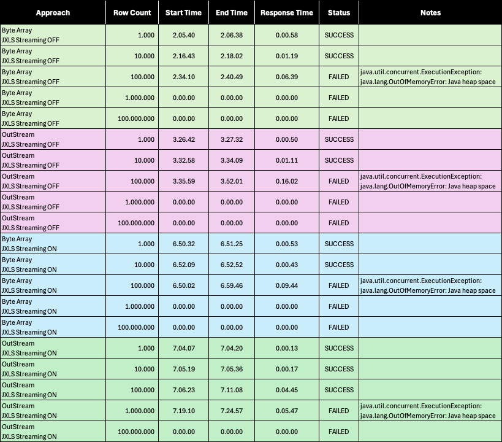

## JXLS
This library is what my team at office currently use. It is very convenience in terms of templating(styling and formatting in Excel).
It hides the complexity of apache poi just by providing template that you want.

All result here is deployed on local docker with 0.2 cpu
and 512Mb memory. So basically there will be 2 API that exports data into Excel(.xlsx) file. One of them return byte 
array as a result and the other is directly put into output stream.

In jxls you can enable or disable streaming option. Therefore, for this I made 4 testcase which are:

- Return Byte Array with streaming OFF
- Return Byte Array with streaming ON
- Directly put to output stream with streaming OFF
- Directly put to output stream with streaming ON

The result is presented below:

By the result above, with the streaming ON the response time is relatively faster.
But still in terms of user experiences it's still too long. There's a lot of testcase and capability that can be explored, such as:

- Different style of templating
- Upgrade CPU and Memory
- Async produced link when file processing is too large.